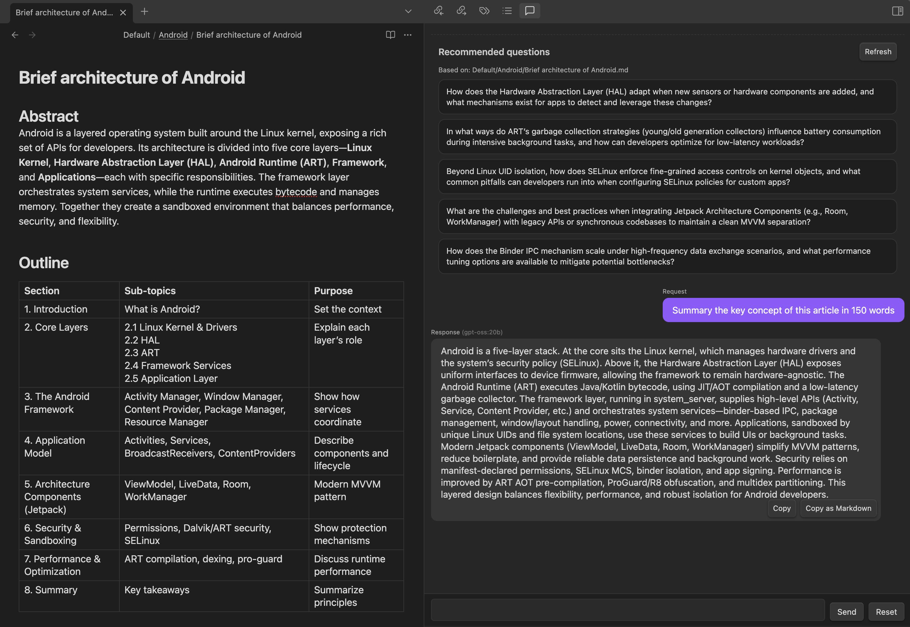

# Obsidian Ollama Plugin

Local-first AI chat inside Obsidian, powered by Ollama's OpenAI-compatible API. Open a side-pane chat, stream Markdown answers, ask context-aware questions about your current note, and manage the default model directly in settings.



The plugin provides a powerful AI chat interface that integrates seamlessly with Obsidian, featuring a dual-panel layout with your content on the left and AI assistance on the right. The interface includes recommended questions, streaming responses, and context-aware interactions based on your active notes.

### Features

- **Side pane chat view**: Ribbon icon and command palette entry to open `Ollama Chat`.
- **Streaming responses**: Answers render as Markdown with auto-scroll and code-block copy buttons.
- **Context from active file**: The current note is sent as context automatically for richer, on-topic replies.
- **Recommended questions**: A suggestions panel proposes 5 follow-up questions based on the active file; click to ask instantly. Can be disabled in settings to prevent unwanted API calls. **Disabled by default** for privacy and performance.
- **Conversation history**: Persists across sessions; use Reset to clear and abort any in-flight response. The Reset button is automatically hidden when there are no messages for the current file.
- **Model selection**: Settings tab lists installed Ollama models and lets you choose the default; includes a Refresh button.

### Requirements

- Obsidian ≥ `0.16.0`
- [Ollama](https://ollama.com) running locally with the OpenAI-compatible endpoint at `http://localhost:11434/v1/`
- A compatible model installed in Ollama. The plugin defaults to `gpt-oss:20b`.

Install a model (example):

```bash
ollama pull gpt-oss:20b
```

Notes:
- The plugin uses the OpenAI SDK pointed at `http://localhost:11434/v1/` with an `apiKey` placeholder (`ollama`). No real API key is required when running locally.
- The Settings dropdown will be populated from `models.list()` if Ollama is running.

### Installation

Manual (development or sideload):
1. Build the plugin (see Development below) to produce `main.js`.
2. Copy `manifest.json`, `main.js`, and `styles.css` into your vault at `VAULT/.obsidian/plugins/obsidian-ollama-plugin/`.
3. In Obsidian, enable the plugin from Settings → Community Plugins.

### Usage

- Open the chat: click the ribbon icon or run the `Open Ollama Chat` command.
- Type your prompt. Press Enter to send, Cmd+Enter to insert a newline.
- Click **Reset** to clear history and cancel ongoing responses. The Reset button automatically appears when you have conversation history and disappears when there are no messages for the current file.
- Use the **copy** buttons on responses and code blocks.
- With an active note open, check the **Recommended questions** panel at the bottom of the chat and click a suggestion to ask it. Note: This feature must be enabled in Settings → Ollama Plugin → "Enable recommendations".

### Settings

- **Default Ollama model**: Choose from installed models (requires Ollama running). Use **Refresh models** to reload the list.
- **Enable recommendations**: Toggle AI-generated question recommendations on/off. When disabled, no API calls are made for suggestions, improving performance and privacy.

### Smart UI Behavior

The plugin intelligently adapts its interface based on the current state:

- **Dynamic Reset Button**: The Reset button automatically appears when you have conversation history for the current file and disappears when there are no messages, keeping the interface clean and intuitive.
- **File-Aware History**: Each file maintains its own conversation history, and the UI updates accordingly when switching between files.
- **Contextual Recommendations**: The recommendation system adapts to your current note content and provides relevant suggestions.

### Recommendation System

The plugin includes an intelligent recommendation system that analyzes your active note and suggests relevant follow-up questions. Here's how it works:

- **Smart Analysis**: When enabled, the system reads your current note content and generates 5 contextual questions
- **Performance Optimized**: Recommendations are cached per file to avoid repeated API calls
- **Privacy First**: Disabled by default to prevent unwanted API calls
- **Real-time Control**: Toggle on/off in settings with immediate effect
- **Context Aware**: Questions are generated based on the specific content of your active note

### Privacy

- All requests are sent to your local Ollama server. The plugin includes the content of your active note as context to improve answers. Nothing is sent to external services unless your Ollama is configured to do so.
- **Recommendations**: When the recommendation feature is enabled, your note content is sent to Ollama to generate contextual questions. When disabled, no content is sent for suggestions.

### Troubleshooting

- “Failed to list Ollama models”: ensure Ollama is running and accessible at `http://localhost:11434` and that your version supports the OpenAI-compatible API.
- “Chat failed. Check Ollama and model settings.”: verify the model exists locally (e.g., `ollama list`) and that the Default model in settings matches an installed model.

### Development

Prereqs: Node.js ≥ 16

```bash
yarn
yarn dev   # develop with esbuild watching
yarn build # typecheck + production build
```

Scripts of interest:
- `dev`: run esbuild in watch mode
- `build`: run `tsc` typecheck then bundle for production
- `version`: bump versions and update `manifest.json`/`versions.json`
- `format` / `format:check`: Prettier

### License

MIT
